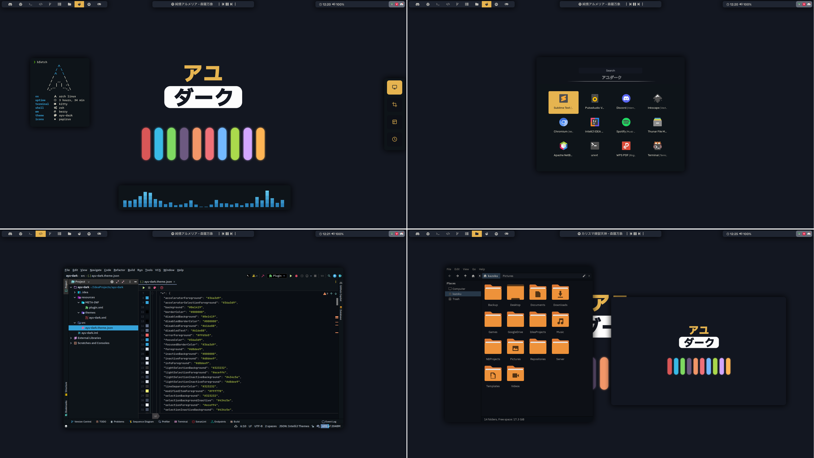

<h1 align="center"><b>dotfiles</b></h1>
<p align="center">
    <a href="LICENSE">
        
    </a>
</p>

<p align="center">
    
</p>

## 💡 About
This repo is my personal configuration files (a.k.a dotfiles).

You can grab anything you like, but be careful, it may contains my personal stuff.

## 📜 Packages list (Arch Linux only)

```
dunst
thunar
papirus-icon-theme
kitty
rofi
```


**AUR:**
```
berry-git
picom-ibhagwan-git
polybar
papirus-folders
```

_Note: May be the list missing something, I'll add it if I remember what to add_

<br>

---

<p align="center">Made with ❤️ by <a href="https://github.com/K4zoku"><i>@K4zoku</i></a></p>
